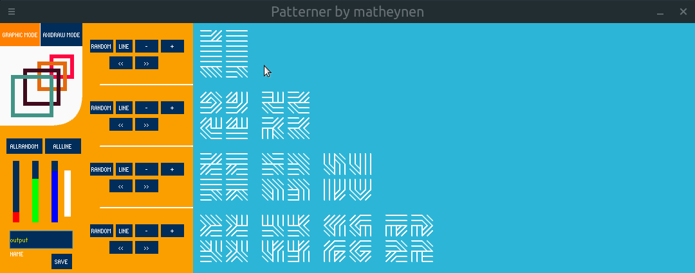
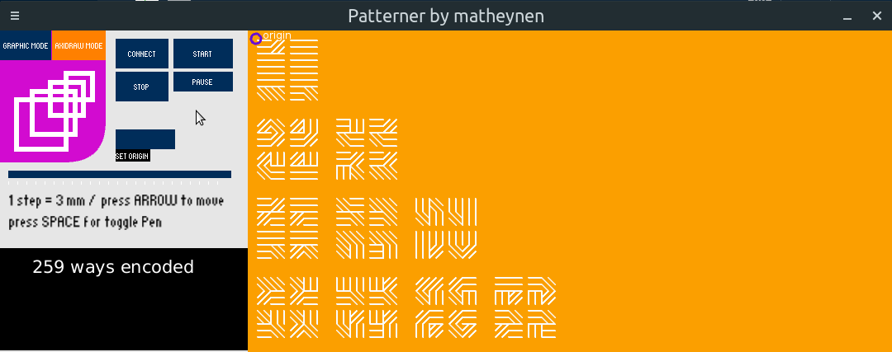

# Patterner
A tool to easy plot or create png from random pattern. Axidraw work are optimized to do less job possible.

## Setup
Just download in a Patterner file, make sure cp5 library is installed. You can try it without Axidraw and create png file.

## Features
* Perfect path plotter optimization

## How to use
You can switch between modes with upper-left buttons: graphic or Axidraw

### Graphic mode

Create line by line pattern or all pattern together
Use +,- button to add or remove pattern, you can make free space
Use <<,>> to move pattern, if there is free space >> will erase it to the right
Use rand to set random of existing pattern
Use line to create progression from 1 to last pattern

Change rgb color of background and brightness of lines
Save as output.png or the name you want

### Axidraw mode

All action are write in the console
Connect button first, check if Axidraw is plugged
Start, pause or stop job like you want with button
Toggle origin button to send origin of job, screen become red, toggle to stop
Slider to change the length of the lines (min 3mm, max 15mm). Warning : don't move while plotting.

Use arrow key to move Plotter and Space to toggle pen

Have fun and enjoy !

